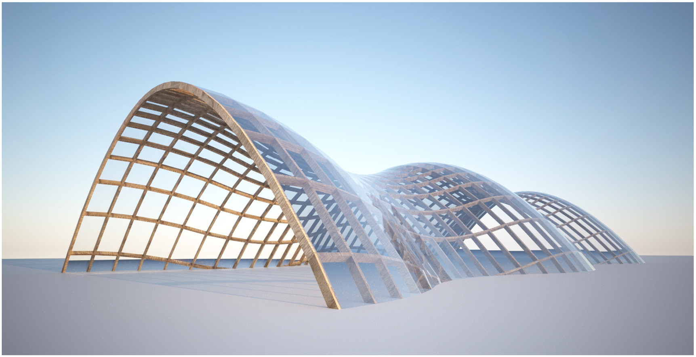
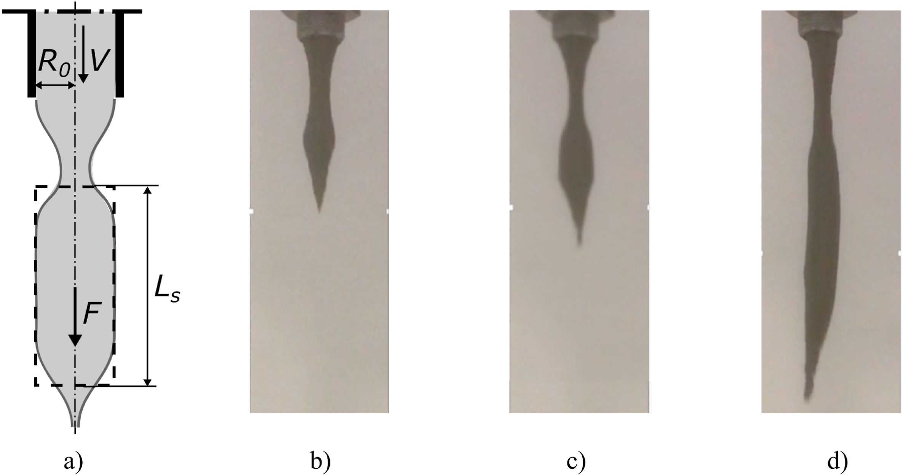




## Architectural geometry and structural morphology

  

The main driver of my research is to [make complex structures affordable](https://www.researchgate.net/publication/349301133_Proposals_to_make_Complex_Structures_Affordable). Complex and curved structures offer an interesting potential to reduce the mass and embodied carbon of building structures. Constructing curved structures requires however to find properties that simplify construction, which may become extremely difficult and rely on high tech methods. The study of properties of discrete surfaces is a field known as _Architectural Geometry_. I am particularly involved in the design rationalization of elastic gridshell structures, which are obtained by elastic deformation of continuous beams. My work leverages results on differential geometry and their implementation in open-source environment.

## Digital concrete
I am focused on developing and applying novel manufacturing technologies to construct complex structures at a lower cost. I have been managing the technological research group on 3D concrete printing of ENPC since 2017. Our access to premium facilites allows us to experiment at large scales, and uncover the true challenges of 3D concrete printing.
My interest lies initially in the determination of fabrication-aware shape definition related to the 3D printing process. This has led me to conduct research on process engineering, between rheology and solid mechanics. I was involved in the definition of several rheological testing procedures that are now commonplace in 3d printing.
More recently, I have been collaborating with other researchers from [Laboratoire Navier](https://navier-lab.fr/) and [LMS](https://lms.ip-paris.fr/) on the simulation of 3D printing process.

  

## Mechanics of shell structures
I developed a strong interest in structural form-finding and structural optimization of continuous and discrete shell structures. On top of developing programs form-finding techniques, I'm interested in the structural behaviour of continuous and discrete shell structures. At the moment, I am applying techniques, such as periodic homogenization, aiming to reduce the computational complexity of mechanical computations to allow real-time interaction with the designer, and eventually solve inverse problems or optimization problems. Other topics of personal interest include pre-stressed and reinforced concrete structures, as well as anisotropic shell structures.

<!-- 
  
 -->
